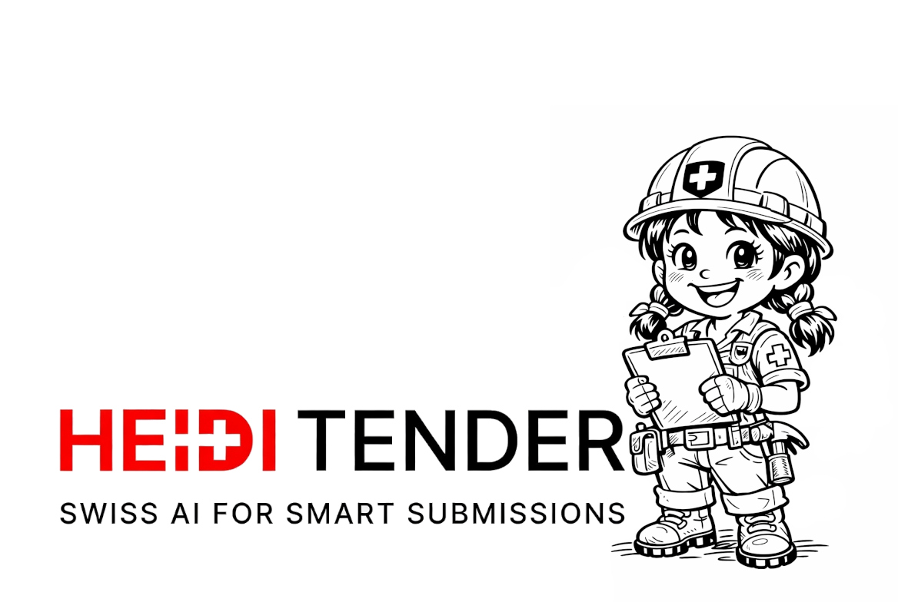

  

<h1 align="center">Heidi Tender</h1>

  <strong>AI-native tender intelligence for teams that want faster, sharper, and more defensible bid decisions.</strong>

  
  
  

  Heidi Tender turns dense tender documents into explainable, shortlist-ready product matches for teams that need speed, rigor, and confidence in every bid decision.

<table>
  <tr>
    <td width="33%" valign="top">
      <strong>From document chaos to structure</strong> 
      Parse tender packs, spreadsheets, archives, and technical files into a clean decision workflow that teams can actually use.
    </td>
    <td width="33%" valign="top">
      <strong>Rules with real operational weight</strong> 
      Combine LLM extraction, hard constraints, soft signals, and SQL-backed filtering so outputs are usable, not just interesting.
    </td>
    <td width="33%" valign="top">
      <strong>Explainability built in</strong> 
      Every candidate can be traced back to requirements, rule logic, evidence, and matching rationale for more confident bidding.
    </td>
  </tr>
</table>

## What We Are Building

Heidi Tender is an end-to-end tender matching platform focused on high-friction procurement workflows. Our current flagship build starts with Swiss public procurement and lighting product matching, helping teams move from unstructured requirements to ranked supplier candidates with much less manual cross-checking.

## Why It Stands Out

- A 7-step core pipeline that separates extraction, rule merge, SQL generation, execution, and ranking
- Human-in-the-loop rule copilot flows so AI suggestions can be reviewed before they affect live jobs
- Realtime job monitoring with step history, events, and stable rule snapshots for audit-friendly operations
- Docker-first runtime with a web app, supplier product database, and knowledge-base bootstrap workflow

## Inside The Platform

- `Next.js` frontend for job orchestration, rules, and stats
- `FastAPI` backend with REST APIs and SSE event streaming
- `PostgreSQL` for app state and `MySQL` for supplier product data
- OpenAI-powered extraction and ranking wrapped in explicit, testable pipeline contracts

## Product Direction

Heidi Tender is being shaped as a practical, production-minded tender intelligence platform: one that helps procurement teams move faster without giving up traceability, rule discipline, or human control.

  Independent project. Not affiliated with Swiss authorities.

